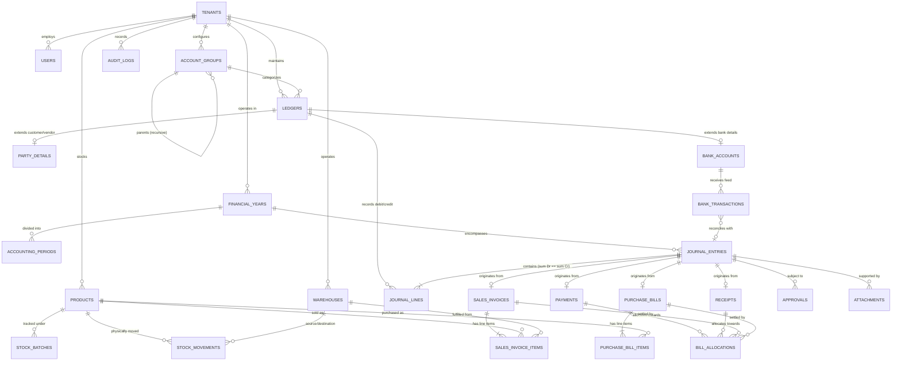

# DATABASE RELATIONSHIPS & ENTITY RELATIONSHIP (ER) MODEL
**Platform:** Modern Enterprise Accounting & Business Management Platform  
**Document:** Entity Relationships, Cardinalities & ER Diagram (Phase 02 Deliverable)  
**Author:** Financial Systems Database Architect

---

## 1. High-Level Entity Relationship Diagram (Mermaid)

---

## 2. In-Depth Analysis of Critical Financial Relationships

### 2.1 The Account Group & Ledger Hierarchy (Recursive Tree)
- **Cardinality:** `ACCOUNT_GROUPS (1) : (0..N) ACCOUNT_GROUPS` and `ACCOUNT_GROUPS (1) : (0..N) LEDGERS`.
- **Accounting Semantics:**
  - Account groups represent the summary classifications required for legal financial statements (e.g., *Current Assets $\to$ Bank Accounts $\to$ Scheduled Banks*).
  - Vouchers **cannot post directly to Account Groups**. Journal lines must reference leaf **Ledgers** (`ledgers.id`).
  - To generate the Trial Balance or Balance Sheet, the system runs recursive common table expressions (CTEs) traversing from parent groups down to child groups and their associated ledger transaction sums.

### 2.2 Business Documents $\to$ The Journal Entry Kernel (1:1 Projection)
- **Cardinality:**
  - `sales_invoices.journal_entry_id` $\to$ `journal_entries.id` (1 : 1 Unique)
  - `purchase_bills.journal_entry_id` $\to$ `journal_entries.id` (1 : 1 Unique)
  - `payments.journal_entry_id` $\to$ `journal_entries.id` (1 : 1 Unique)
  - `receipts.journal_entry_id` $\to$ `journal_entries.id` (1 : 1 Unique)
- **Accounting Semantics:**
  - Business users work with domain documents: an invoice with tax slabs, discounts, shipping addresses, and items.
  - The moment the invoice is **posted**, the application services layer creates the corresponding `journal_entries` record and multiple `journal_lines` in the same database transaction:
    - $\text{Debit Customer Ledger}$ (Total Invoice Amount)
    - $\text{Credit Sales Ledger}$ (Taxable Amount)
    - $\text{Credit Output CGST Ledger}$ (Tax Amount)
    - $\text{Credit Output SGST Ledger}$ (Tax Amount)
    - $\text{Credit/Debit Round-Off Ledger}$ (Fractions of a Rupee)
  - If an invoice is cancelled or voided, the system does not delete the journal entry; it posts a **reversal journal entry** or marks the entry `VOID`, ensuring non-repudiation and MCA audit compliance.

### 2.3 Journal Entry $\to$ Journal Lines (1 : N Invariant Bond)
- **Cardinality:** `journal_entries (1) : (2..N) journal_lines`.
- **Accounting Semantics:**
  - A journal entry is physically incomplete without at least two lines.
  - The database trigger `trg_verify_journal_balance` enforces Luca Pacioli’s double-entry invariant:
    $$\sum_{\text{direction}=\text{'DEBIT'}} \text{amount} = \sum_{\text{direction}=\text{'CREDIT'}} \text{amount}$$
  - The check is `DEFERRABLE INITIALLY DEFERRED`, allowing all line items to be inserted within a multi-row statement before validating zero discrepancy at commit time.

### 2.4 Bill-by-Bill Allocation Engine (Many-to-Many Settlement)
- **Relationship:** `PAYMENTS / RECEIPTS (M) : (N) SALES_INVOICES / PURCHASE_BILLS` via `bill_allocations`.
- **Accounting Semantics:**
  - In commercial accounting, a single receipt of ₹ 1,00,000 might settle three different past invoices (e.g., ₹ 40,000 for Inv #101, ₹ 35,000 for Inv #104, ₹ 25,000 partial payment for Inv #108).
  - Conversely, a large invoice of ₹ 5,00,000 might be paid across four staggered payments.
  - `bill_allocations` stores the exact linkage (`target_document_id`, `allocated_amount`, `allocation_type`).
  - This structure powers real-time **Accounts Receivable Aging** (0-30, 31-60, 61-90, 90+ days) and tracks unallocated "On Account" or "Advance" customer balances.

### 2.5 Dual-Track Perpetual Inventory: Physical Stock vs. Financial COGS
- **Relationship:** `stock_movements` (Physical) $\leftrightarrow$ `journal_entries` (Financial).
- **Accounting Semantics:**
  - Unlike periodic accounting systems that only calculate stock at month-end via manual physical counts, our platform uses **Perpetual Inventory Tracking**.
  - When goods are received via a Purchase Bill:
    1. A `stock_movements` record increases physical warehouse inventory.
    2. A journal entry debits the `Inventory Asset` ledger and credits `Sundry Creditors`.
  - When goods are delivered via a Sales Invoice:
    1. A `stock_movements` record decreases physical warehouse inventory.
    2. A journal entry debits `Cost of Goods Sold (COGS)` and credits `Inventory Asset` at the evaluated FIFO / Weighted Average unit cost.

### 2.6 Bank Account $\leftrightarrow$ Ledger Extension (1 : 1 Sub-type)
- **Relationship:** `ledgers (1) : (1) bank_accounts`.
- **Accounting Semantics:**
  - A bank account is an accounting ledger with banking attributes (Account number, IFSC, Branch, OD limits).
  - Foreign key constraint: `bank_accounts.ledger_id` references `ledgers.id` with `UNIQUE` and `ON DELETE RESTRICT`.
  - External bank statement feeds populate `bank_transactions`, which link to internal `journal_entries` during reconciliation, capturing the exact date the bank cleared the transaction.

### 2.7 Referential Integrity & Anti-Orphan Policies
| Master Entity | Child Reference | Foreign Key Action | Rationale |
| :--- | :--- | :--- | :--- |
| `ledgers` | `journal_lines.ledger_id` | `ON DELETE RESTRICT` | A ledger with posted financial history can **never** be deleted. It can only be archived (`is_active = false`). |
| `products` | `sales_invoice_items.product_id` | `ON DELETE RESTRICT` | Prevents deletion of catalog items that exist on legal tax documents. |
| `journal_entries` | `journal_lines.journal_entry_id`| `ON DELETE CASCADE` | Only applicable to unposted drafts. Posted entries cannot be deleted due to audit triggers. |
| `tenants` | All tenant entities | `ON DELETE RESTRICT` | Prevents accidental cascading wipes of entire company audit trails. |
